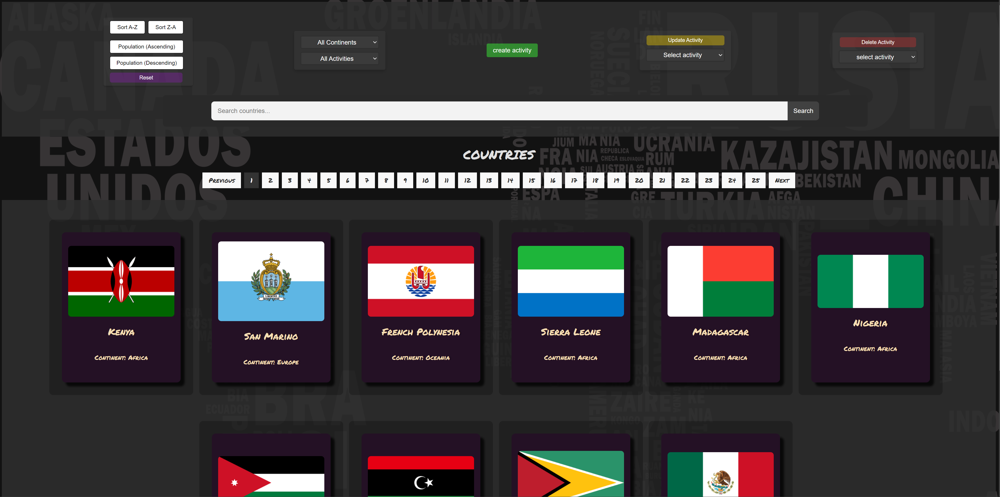
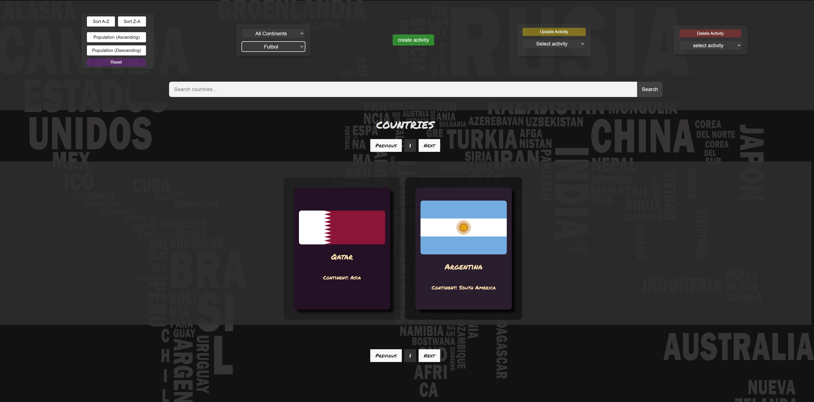

# COUNTRIES APP - CRUD Completo

## ** OBJETIVOS**

- Construir una Single Page Application utlizando las tecnologías: **React**, **Redux**, **Node**, **Express** y **Sequelize - postgresSQL**.
- Poner en práctica recursos básicos de estilos y diseño (UX : UI).
- Aprender mejores prácticas.
- Aprender y practicar el workflow de GIT.
- Utilizar y practicar testing.

 

---

## **⚠️ IMPORTANTE**

### **⛔️ Está rotundamente prohibido utilizar librerías externas para aplicar estilos a la SPA. Tendrás que utilizar CSS mediante algunas de las opciones vistas en el bootcamp (CSS, Legacy, Inline Styling, CSS Modules o Styled Components).**

 

## ** ENUNCIADO GENERAL**

La idea de este proyecto es construir una aplicación web a partir de la API [**countries**] en la que se pueda:

- Buscar países.
- Visualizar la información de los países.
- Filtrarlos.
- Ordenarlos.
- Crear actividades turísticas.

⚠️ Para las funcionalidades de filtrado y ordenamiento NO se puede utilizar los endpoints de la API externa que ya devuelven los resultados filtrados u ordenados.

## Funcionalidades CRUD

La aplicación cuenta con las siguientes funcionalidades CRUD:

1. Crear actividades turísticas: Los usuarios pueden crear nuevas actividades turísticas asociadas a un país específico, ingresando el nombre de la actividad, su dificultad, duración y temporada recomendada.
2. Actualizar actividades turísticas: Los usuarios pueden modificar la información de las actividades turísticas existentes.
3. Eliminar actividades turísticas: Los usuarios pueden eliminar actividades turísticas que ya no deseen.

### **Único end-point que se puede utilizar**

- [**http://localhost:5000/countries**]

 

 

  

 

 

 

 

 